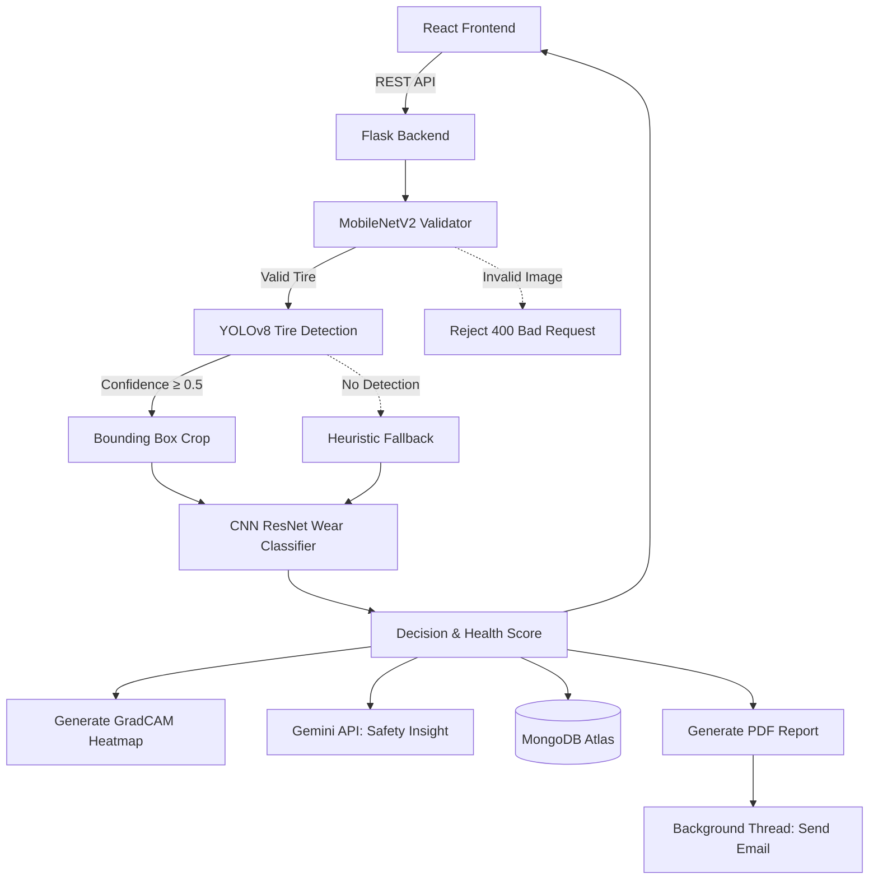

# System Architecture & Data Flow

SafeTread uses a modern, decoupled architecture. A React single-page application (SPA) communicates with a Python Flask RESTful API, backed by MongoDB Atlas and a machine learning pipeline.

---

## High-Level Architecture Diagram

---

## 1. Authentication Flow

SafeTread uses **JSON Web Tokens (JWT)** for stateless, secure authentication.

1. **Registration/Login**: The user submits their email and password to `/login` or `/register`.
2. **Hash & Verify**: The backend uses `bcrypt` to hash passwords and verify credentials against MongoDB.
3. **Token Generation**: Upon successful login, the backend generates a JWT signed with `JWT_SECRET` (valid for 24 hours).
4. **Client Storage**: The frontend stores this token in `localStorage`.
5. **Authenticated Requests**: For all protected routes (e.g., `/api/predict-user`, `/api/prediction-history`), the frontend attaches the token in the `Authorization: Bearer <token>` header.
6. **Backend Verification**: The backend `@token_required` decorator decodes the token. If valid, the request proceeds; if expired/tampered, it returns a `401 Unauthorized`.

---

## 2. Frontend / Backend Communication

The frontend uses **Axios** to communicate with the backend. 
- An Axios interceptor (`frontend/src/api/axios.js`) automatically attaches the JWT token to all outbound requests.
- File uploads are transmitted using `multipart/form-data`.
- Cross-Origin Resource Sharing (CORS) is explicitly enabled on the Flask backend to allow requests from `localhost:3000`.

### State Management
State management on the frontend is handled primarily through **React Context API** and local state hooks (`useState`, `useEffect`).
- **`AuthContext`**: Manages the user's logged-in state, stores the JWT token, and exposes `login()` and `logout()` functions globally to the component tree.
- **Page-Level State**: Individual pages (like `UploadPage`) manage their own loading states, form inputs, and error messages locally.

---

## 3. The Machine Learning Pipeline

The prediction pipeline is executed sequentially to ensure maximum accuracy and safety:

1. **Gatekeeper (Local Validator)**: A lightweight `MobileNetV2` model quickly checks if the uploaded image actually contains a tire. This prevents users from uploading random images and getting false "Healthy" readings.
2. **Object Detection (YOLOv8)**: If valid, a custom-trained YOLO model locates the exact position of the tire tread within the image, generating a bounding box.
3. **Cropping**: The image is cropped to just the tire tread to eliminate background noise (wheels, shadows, ground).
4. **Classification (ResNet50)**: The cropped image is passed to a heavy ResNet50 model, which outputs a precise wear probability (0.0 to 1.0).
5. **Decision Logic**: The probability is mapped to strict, human-readable categories ("Healthy", "Warning", "Critical") ensuring consistent UI experiences.
6. **Explainability**: A GradCAM heatmap is generated over the crop, highlighting the specific areas of the tread that the AI focused on to make its decision.
